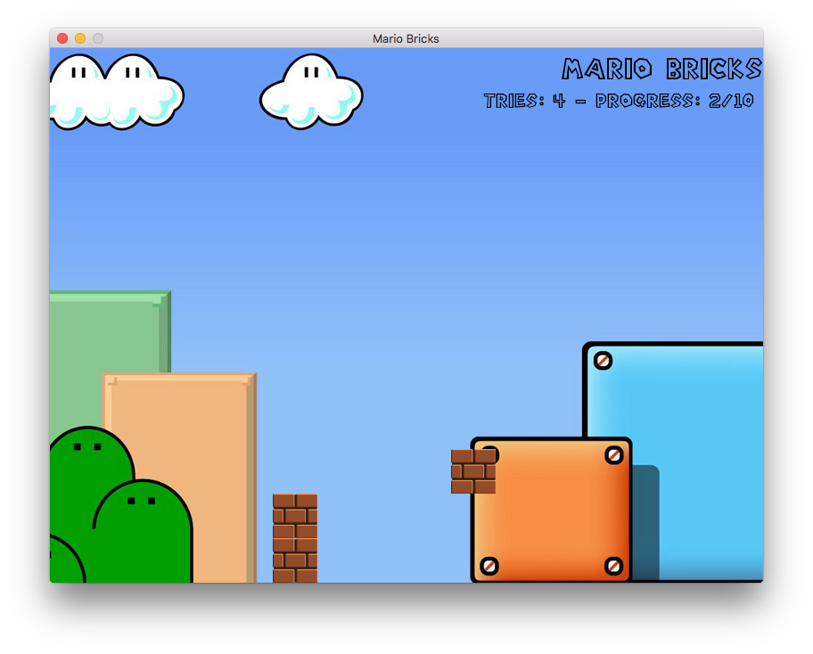

# mario-bricks

Minimal Mario game done with Allegro 5 library

## Screenshot

## Requirements

* C compiler (like GCC)
* Allegro 5 library

To install Allegro check [Allegro's site](http://liballeg.org)

## Build

The compilation process is done with make (with a Makefile):

    make

After compiling the game can be started with:

    make play
